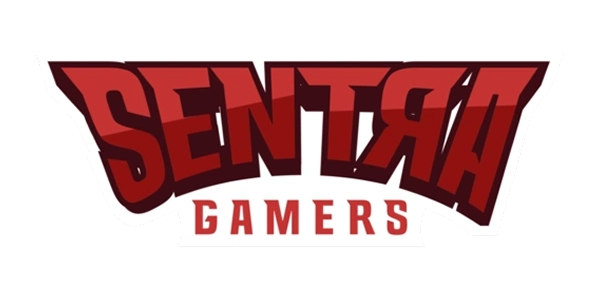

# Sentra Gamers



## About

Sentra Gamers is a comprehensive gaming portal platform that serves as a one-stop destination for gamers. Our platform provides a wide range of services and features designed to enhance the gaming experience and build a vibrant gaming community.

## Features

### 🎮 Tournament Information
Stay updated with the latest gaming tournaments, schedules, participants, and results. From local competitions to international championships, we've got you covered.

### 📰 Gaming News
Get the latest news about game releases, updates, industry trends, and more. Our dedicated team ensures you never miss important gaming developments.

### 💰 Top-up Marketplace
Easily purchase game credits, points, and virtual currencies for your favorite games through our secure top-up marketplace.

### 🛒 Gaming Gear Shop
Browse and purchase high-quality gaming peripherals, accessories, and merchandise from top brands at competitive prices.

### 👥 Community Page
Connect with fellow gamers, share experiences, discuss strategies, and build lasting friendships in our active community forums.

### ⭐ Membership Content
Access exclusive content, special offers, early access to events, and unique perks with our premium membership program.

## Technology Stack

- **Frontend**: Next.js, React, TypeScript, Tailwind CSS
- **State Management**: React Context API
- **Styling**: Tailwind CSS with custom theme
- **Deployment**: Vercel

## Getting Started

### Prerequisites

- Node.js (v18 or higher)
- npm or yarn

### Installation

```bash
# Clone the repository
git clone https://github.com/yourusername/sentra-gamers.git

# Navigate to the project directory
cd sentra-gamers

# Install dependencies
npm install
# or
yarn install

# Start the development server
npm run dev
# or
yarn dev
```

Open [http://localhost:3000](http://localhost:3000) with your browser to see the application.

## Project Structure

```
sentra-gamers/
├── app/                # Next.js app directory
├── components/         # Reusable UI components
│   ├── layout/         # Layout components (Header, Footer, etc.)
│   └── ui/             # UI components (buttons, inputs, etc.)
├── containers/         # Page-specific container components
├── lib/                # Utility functions and helpers
├── public/             # Static assets
├── types/              # TypeScript type definitions
│   └── models/         # Data models
└── constants/          # Constants and mock data
```

## Contributing

We welcome contributions to Sentra Gamers! Please feel free to submit issues and pull requests.

## License

This project is licensed under the MIT License - see the LICENSE file for details.